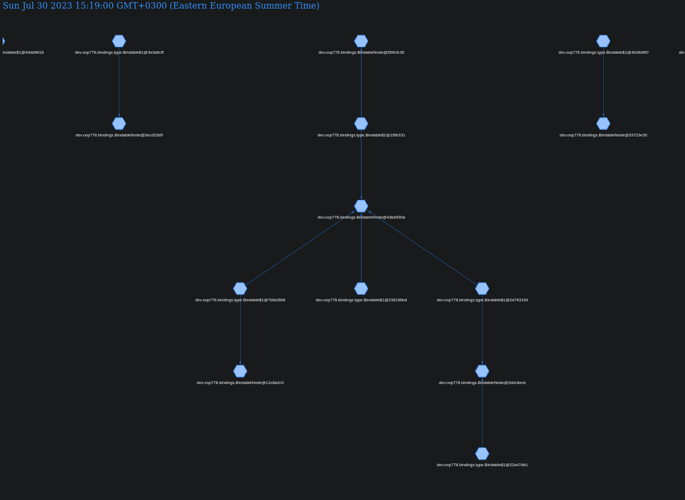
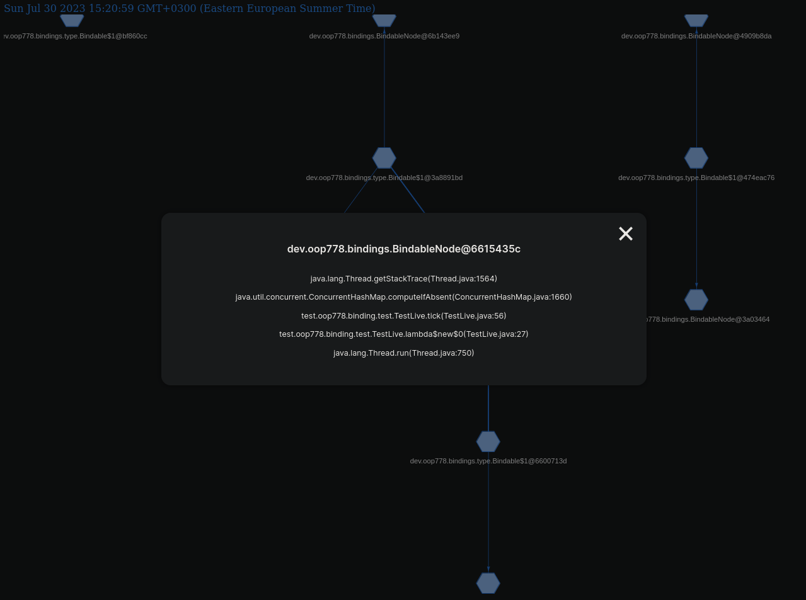

# Bindings


This library gives you the flexibility for managing lifecycle of your objects, you're able to bind objects to another objects, control the order of closing, if there's memory leaks you can find the source of them very quickly using built in dumping tool, which produces a graph of all unclosed bindable instances.

## See in action
You can pull the project, and run the `src/test/oop778/binding/test/TestLive.java` after successful run you should see `dump.html` in the 
project directory. You can open it in any browser.

## Dump Result by running `TestLive` file


If you want to see information about specific node, you can just click on it and it'll show you the class name of the Bindable and stack 
trace where it was created.


## Configuring
You can configure the library by passing system properties programmatically or by passing them as JVM arguments.
There's following properties to configure:
- `BindingsTracing (default: false)` - This will enable or disable tracing creation Bindable instances
- `BindingsTracingStackSizeLimit (default: 5)` - This will limit how much of stacktrace is collected
- `BindingsTracingTimeStamp (default: false)`
## Usage
```java
// Create a new Bindable instance
Bindable.create(Runnable); // will create a new Bindable instance and will call your runnable once closed

// Implementing Bindable
class MyClass implements Bindable {
    @Override
    public void close() {
        Bindable.super.close(); // This call must be done, otherwise you'll get a memory leak
        // Your code here (if you do not need to have own logic here, just don't override it)
    }
}

// Implementing TypedBindable
class MyClass2 implements TypedBindable<MyClass2> {}
new MyClass2().bindTo(something); // will return instance of MyClass2    

// Binding one to another
Bindable bindableA = Bindable.create(() -> System.out.println("A"));
Bindable bindableB = Bindable.create(() -> System.out.println("B"));

bindableB.bindTo(bindableA);
bindableA.close(); // Will close both A and B

// Making sure your bindable closes last
Bindable bindableA = Bindable.create(() -> System.out.println("A"));
Bindable bindableB = Bindable.create(() -> System.out.println("B"));
Bindable bindableC = Bindable.create(() -> System.out.println("C"));

bindableB.bindTo(bindableA, BindingOrder.LAST);
bindableC.bindTo(bindableA)

bindableA.close() // Will produce B, C, A

// Usage of dumping
Bindings.dumpToFile("dump.html"); // Will dump all unclosed bindable instances to the file

// Usage of AutoBindable
class MyAutoBindableClass extends AutoBindable {
    public MyAutoBindableClass() {
        // Will bind all methods of this class returning bindable to this instance if it's instance of Bindable otherwise 
        // throw error
        this.autoBind();
        this.autoBind(true); // Will bind all methods of this class and hierarchy (interfaces & extending classes) returning bindable to this instance if it's instance of Bindable otherwise 
        // throw error
        
        this.autoBind(Bindable); // Will do what autobind() does but will bind to specified Bindable
        this.autoBind(Bindable, true); // Will do what autobind(true) does but will bind to specified Bindable
    }
    
    private Bindable listener1() {
        // Your code here
    }
    
    private Bindable listener2() {
        // Your code here
    }
}
```

## Bindings diagram

