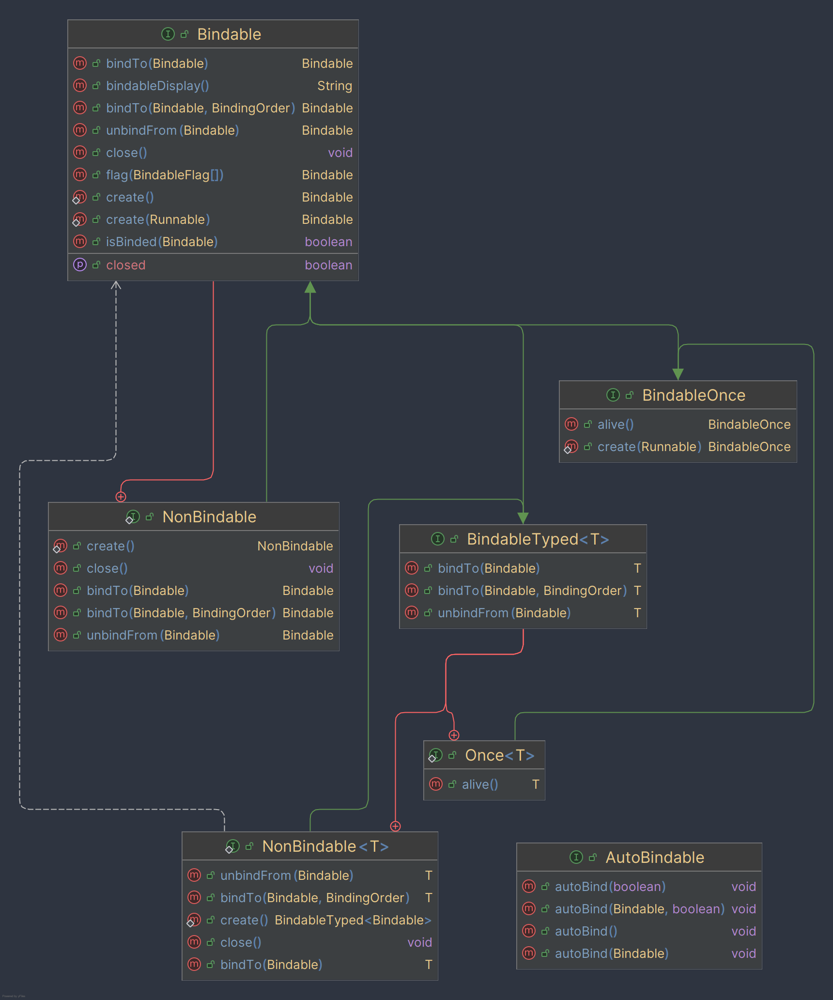

# Bindings


## 0.5 version changelog:
- The new version has got rid of HTML nodes viewer with in file replacement for easability when working with huge trees
- The new version has introduced a "once" bindable that cannot be binded to unless alive() is called, this ensures that you can have objects that only once can be created
- The new version has gotten rid of BindableCollection to maintain the simplicity of the system
- The new version has improved memory footprint by 74-75%
- The new version has been tested more in a highly concurrent scenarios
- The new version has introduced ability to listen for tree changes: node creation, node close & dump, so you can add your own metrics to dump files to help you detect issues faster by default it comes with BindingsStackTracker & BindingsTimeStamp
- Added bindableDisplay() method in Bindable to allow you to customize how you display your bindable instances in dump
- Move to java 17
- Add statefulBindTo method which returns true if binded, else if not (means the bindable you're trying to bind to has closed)

This library gives you the flexibility for managing lifecycle of your objects, you're able to bind objects to another objects, control the order of closing, if there's memory leaks you can find the source of them very quickly using built in dumping tool, which produces a graph of all unclosed bindable instances.

## Getting Started

Bindings are hosted on Maven Central to use it add the following dependency to your project:

### Maven
```xml
<dependency>
    <groupId>dev.oop778</groupId>
    <artifactId>bindings</artifactId>
    <version>VERSION</version>
</dependency>
```

### Gradle
```gradle
implementation 'dev.oop778:bindings:VERSION'
```

## See in action
You can pull the project, and run the `src/test/oop778/binding/test/TestLive.java` after successful run you should see `dump.html` in the 
project directory. You can open it in any browser.

## Dump Result by running `TestLive` file
```java
=== Bindings Dump ===
Timestamp: Thu Jan 30 08:18:24 EET 2025

Counts By Class:
	dev.oop778.bindings.type.Bindable$1: 19589

Node: Bindable$1{10577}
Created Ago = 2264ms
Stack = 
test.oop778.binding.test.TestLive.tick(TestLive.java:76)
test.oop778.binding.test.TestLive.lambda$new$0(TestLive.java:35)
java.base/java.lang.Thread.run(Thread.java:840)
  Edges:
    -> Bindable$1{5545} [direction=FROM, order=NORMAL, seq=0]

Node: Bindable$1{11339}
Created Ago = 2524ms
Stack = 
test.oop778.binding.test.TestLive.tick(TestLive.java:76)
test.oop778.binding.test.TestLive.lambda$new$0(TestLive.java:35)
java.base/java.lang.Thread.run(Thread.java:840)
  Edges:
    -> Bindable$1{3089} [direction=FROM, order=NORMAL, seq=0]

Node: Bindable$1{11457}
Created Ago = 2655ms
Stack = 
test.oop778.binding.test.TestLive.tick(TestLive.java:76)
test.oop778.binding.test.TestLive.lambda$new$0(TestLive.java:35)
java.base/java.lang.Thread.run(Thread.java:840)
  Edges:
    -> Bindable$1{1898} [direction=TO, order=NORMAL, seq=0]

Node: Bindable$1{11665}
Created Ago = 3545ms
Stack = 
test.oop778.binding.test.TestLive.tick(TestLive.java:76)
test.oop778.binding.test.TestLive.lambda$new$0(TestLive.java:35)
java.base/java.lang.Thread.run(Thread.java:840)
  Edges:
    -> Bindable$1{1318} [direction=TO, order=NORMAL, seq=0]
    -> Bindable$1{18926} [direction=TO, order=NORMAL, seq=1]
    -> Bindable$1{2095} [direction=FROM, order=NORMAL, seq=2]

Node: Bindable$1{11666}
Created Ago = 2903ms
Stack = 
test.oop778.binding.test.TestLive.tick(TestLive.java:76)
test.oop778.binding.test.TestLive.lambda$new$0(TestLive.java:35)
java.base/java.lang.Thread.run(Thread.java:840)
  Edges:
    -> Bindable$1{1318} [direction=TO, order=NORMAL, seq=0]

Node: Bindable$1{11761}
Created Ago = 1921ms
Stack = 
test.oop778.binding.test.TestLive.tick(TestLive.java:76)
test.oop778.binding.test.TestLive.lambda$new$0(TestLive.java:35)
java.base/java.lang.Thread.run(Thread.java:840)
  Edges:
    -> Bindable$1{11762} [direction=FROM, order=NORMAL, seq=0]
```

## Usage
```java
// Create a new Bindable instance
Bindable.create(Runnable); // will create a new Bindable instance and will call your runnable once closed

// Implementing Bindable
class MyClass implements Bindable {
    @Override
    public void close() {
        Bindable.super.close(); // This call must be done, otherwise you'll get a memory leak
        // Your code here (if you do not need to have own logic here, just don't override it)
    }
}

// Implementing TypedBindable
class MyClass2 implements TypedBindable<MyClass2> {}
new MyClass2().bindTo(something); // will return instance of MyClass2    

// Binding one to another
Bindable bindableA = Bindable.create(() -> System.out.println("A"));
Bindable bindableB = Bindable.create(() -> System.out.println("B"));

bindableB.bindTo(bindableA);
bindableA.close(); // Will close both A and B

// Making sure your bindable closes last
Bindable bindableA = Bindable.create(() -> System.out.println("A"));
Bindable bindableB = Bindable.create(() -> System.out.println("B"));
Bindable bindableC = Bindable.create(() -> System.out.println("C"));

bindableB.bindTo(bindableA, BindingOrder.LAST);
bindableC.bindTo(bindableA)

bindableA.close() // Will produce B, C, A

// Usage of dumping
Bindings.getInstance().dumpToFile(Paths.get("dump.html")); // Will dump all unclosed bindable instances to the file

// Usage of AutoBindable
class MyAutoBindableClass extends AutoBindable {
    public MyAutoBindableClass() {
        // Will bind all methods of this class returning bindable to this instance if it's instance of Bindable otherwise 
        // throw error
        this.autoBind();
        this.autoBind(true); // Will bind all methods of this class and hierarchy (interfaces & extending classes) returning bindable to this instance if it's instance of Bindable otherwise 
        // throw error
        
        this.autoBind(Bindable); // Will do what autobind() does but will bind to specified Bindable
        this.autoBind(Bindable, true); // Will do what autobind(true) does but will bind to specified Bindable
    }
    
    private Bindable listener1() {
        // Your code here
    }
    
    private Bindable listener2() {
        // Your code here
    }
}

```

## Bindings diagram
